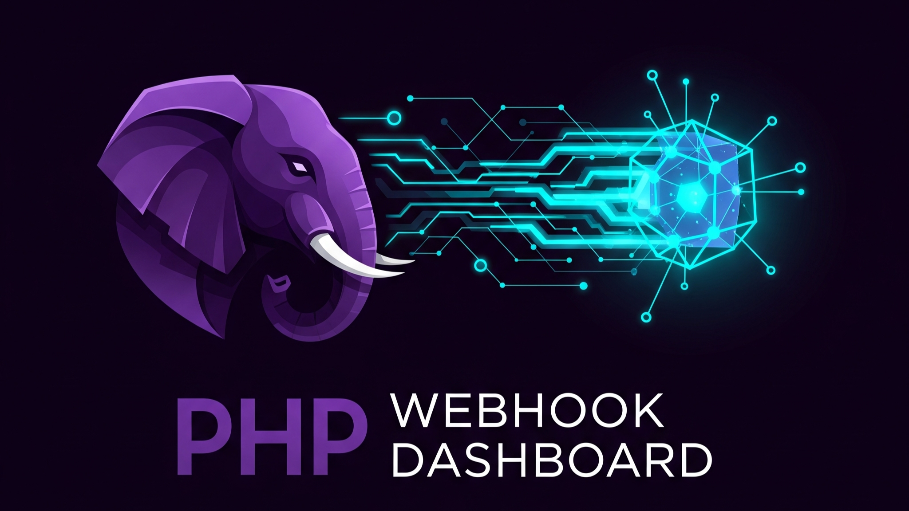
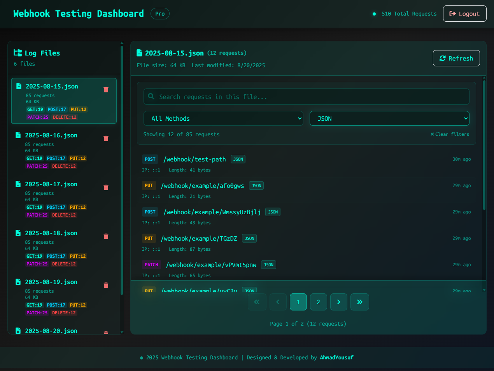
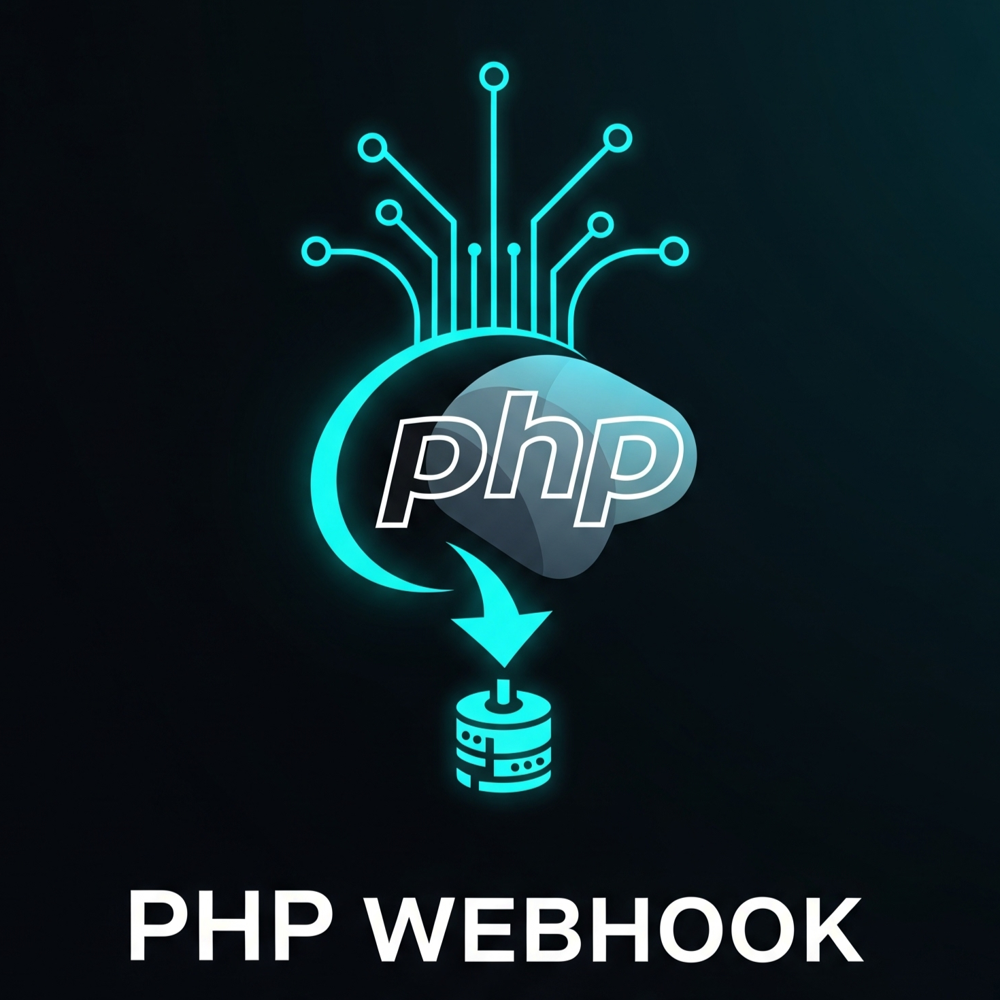

<p align="center">
	
</p>

# PHP-WebHook

A modern PHP-based webhook endpoint and log viewer with a beautiful dashboard.


## Features

- **Webhook Endpoint**: Accepts and logs incoming HTTP requests (GET, POST, PUT, DELETE, PATCH, etc.).
- **Comprehensive Logging**: Captures headers, cookies, query params, form data, files, JSON, XML, raw body, and more.
- **Daily Log Files**: Stores requests in daily JSON files under `src/log/`.
- **Admin Dashboard**: Secure login to view, search, filter, and delete logs via a responsive Tailwind CSS/Alpine.js dashboard.
- **AJAX Actions**: Delete log files or individual requests without page reloads.
- **Statistics**: View request method and content type stats per log file.
- **Beautiful UI**: Neon-glass styled dashboard, mobile-friendly, with custom scrollbars and icons.
- **Branding Assets**: Professional `logo.png`, `banner.png`, and `panel.png` included in the `asset/` folder for use in your dashboard and documentation.

---

### Asset Usage

- **Banner**: Displayed at the top of this README for project presentation.
- **Logo**: Provided in `asset/logo.png` for branding; use in dashboard header or documentation as needed.
- **Panel**: Preview of the dashboard UI, available in `asset/panel.png` for docs or presentations.


## Usage

1. **Deploy** the contents of `src/` to your PHP server.
2. **Send webhooks** to `index.php` (root of `src/`). All requests are logged.
3. **View logs**: Go to `/src/index.php?view_logs` and log in with:
	 - Username: `admin`
	 - Password: `xyz`
4. **Dashboard**: Browse, search, filter, and delete logs. View request details, payloads, headers, and cookies.


## Dashboard Preview

<p align="center">
	
	<br>
	<em>Dashboard panel preview</em>
</p>

## File Structure

```
asset/
	banner.png
	logo.png
	panel.png
src/
	index.php
	.htaccess
	log/
		YYYY-MM-DD.json
test/
	simple_test.py
	test.py
LICENSE
README.md
```


## Security

- Simple session-based login for admin dashboard.
- Webhook endpoint is open for receiving requests.


## Credits

<p align="left">
	
	Designed & Developed by <a href="https://0xAhmadYousufcom" target="_blank">AhmadYousuf</a>
</p>